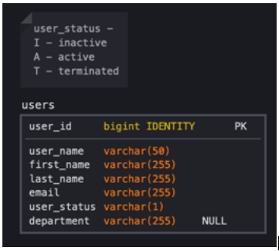

# Origianl Doc

Please, create a small project using guidelines below. 
 
Summary:
  * Technical requirements:
    * Using Angular 16
        * Use Material components - https://material.angular.io/
        * For testing use Jasmine and Karma
    * Using Go 1.22
        * Use echo as web framework - https://echo.labstack.com/
        * To access data use - https://github.com/Masterminds/squirrel
        * For testing use 
            * Ginkgo https://github.com/onsi/ginkgo
            * Gomega https://github.com/onsi/gomega
  * Application requirements:
    * Create a small web application where user can:
        * See list of existing users (show data in a simple grid)
        * Create user 
        * Update user
        * Delete user
        * Show proper buttons to Create/Update/Delete users
        * Make sure UI uses router for all views and/or dialogs
        * Implement basic error handling and validation:
            * Front-end - required fields, validate email structure, show API errors
            * Back-end – return meaningful error if username already exists
        * Structure Angular application using Angular best practices
        * Follow MVC pattern for Go service
        * Follow style guides: 
            * Go - https://github.com/uber-go/guide/blob/master/style.md
            * Angular - https://angular.io/guide/styleguide
        * No authentication / authorization is required.
        * Include swagger documentation.
    * We are using PostgreSQL, but you can use any SQL database for this project.
    * Cover backend and front-end code with unit-tests to a level that you feel appropriate.
    * Check in your code to any git repo (bitbucket, gitlab, github)
      * You can create 2 repositories for Go and Angular code or 1 mono-repo (whichever you prefer)

## [Backend README.md](./backend/README.md)

## [Frontend README.md](./frontend/README.md)
